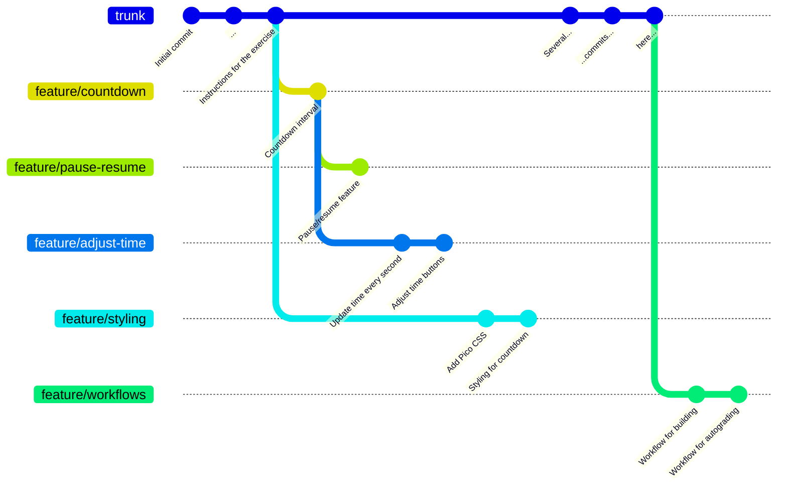
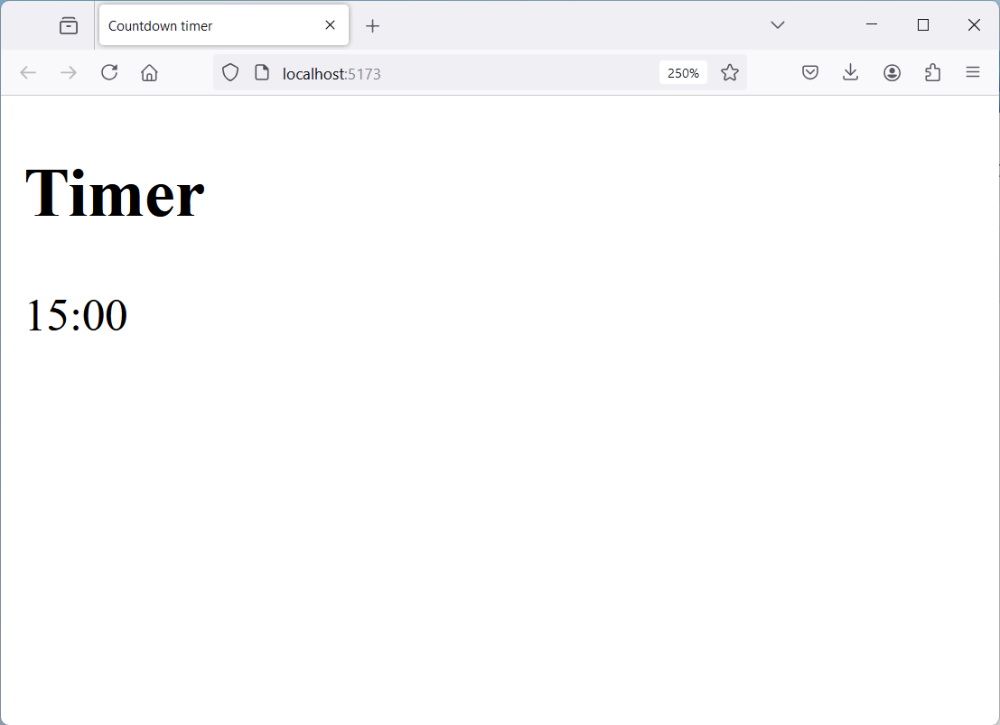
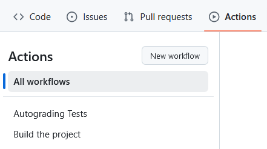
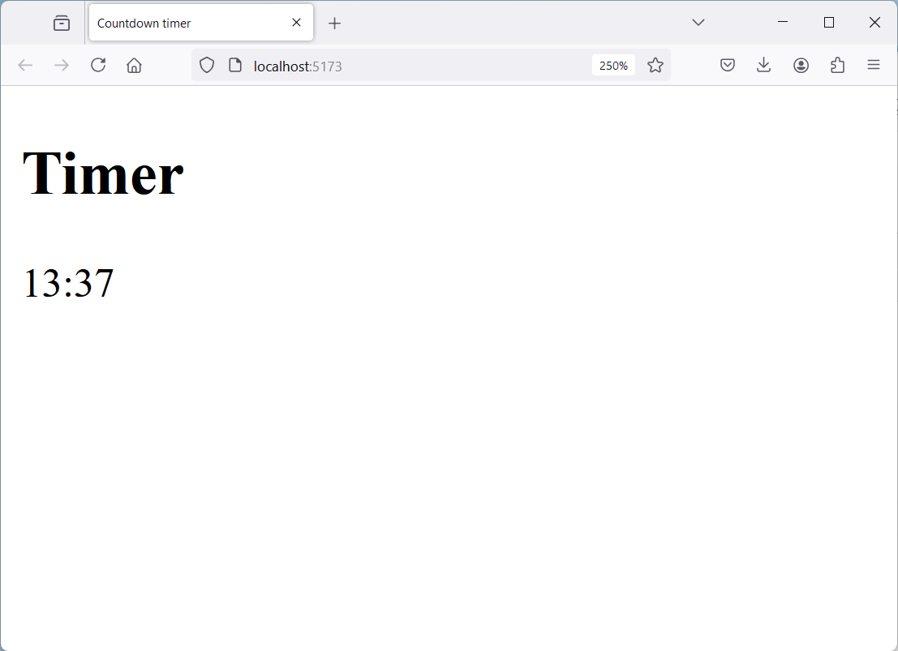
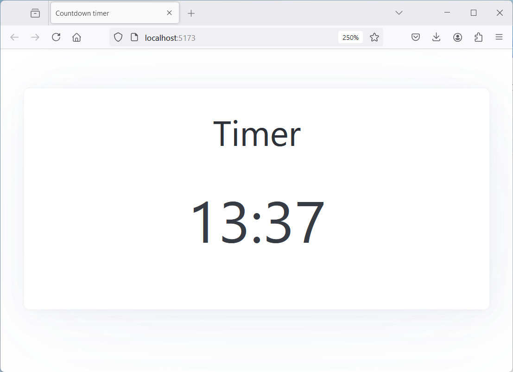
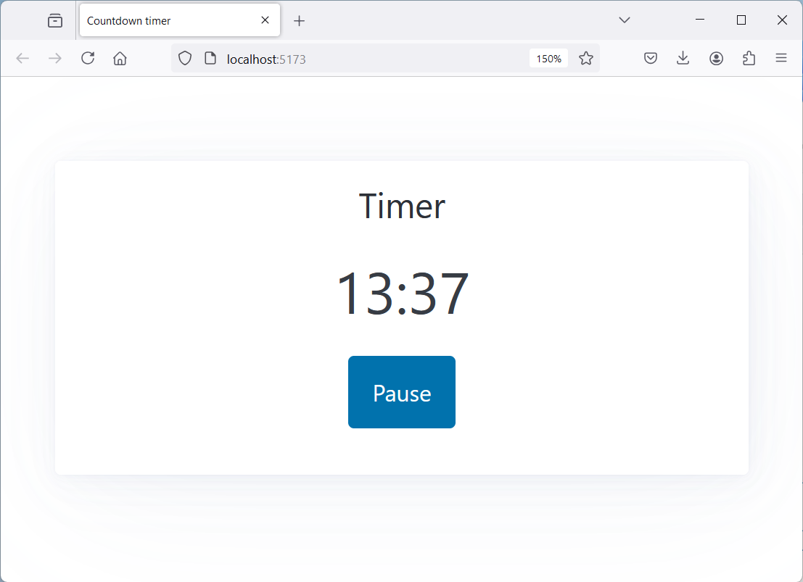
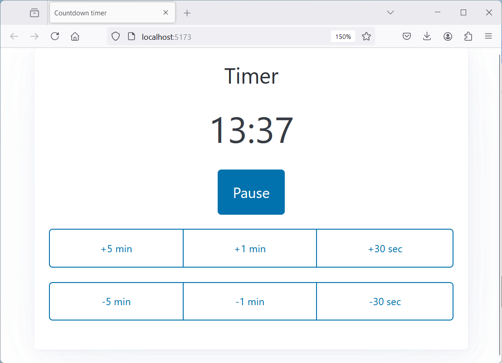

# Countdown Timer (Git Merge Exercise)

This repository contains a simple countdown timer application built with [React](https://react.dev/) and [Vite](https://vite.dev/). Several features of the application have already been implemented, each of them in a separate branch. The goal of this exercise is to merge these branches into the trunk branch using Git.

In the exercise, we will be merging branches on our local copy of the repository, but you could also merge the branches directly in GitHub. In this exercise we want to run the application locally and see the changes in action, so we will be merging the branches locally. You can use either the command line or a GUI client to do this.

Most of the branches in this exercise can be merged to `trunk` automatically, as they do not conflict with previous changes. However, you will encounter at least one merge conflict that you will need to resolve manually. Don't worry, as conflicts are a normal part of working with Git, and resolving them is a valuable skill to learn.

You will not need to write new code, but you will need to understand a bit of the existing code. Although the code uses React, Vite and TypeScript, you don't need to be an expert in any of these. The merge conflicts require mainly understanding in HTML and perhaps a bit of JavaScript. Adding new code or making new changes is allowed, as long as the required features are merged, but it can lead to increased complexity.

> [!NOTE]
> You will need Node.js and npm installed on your machine to run the application and to complete the exercise.
>
> We recommend using a [GitHub Codespace](https://github.com/features/codespaces) or a development container, which already have Node.js and npm installed. See the [VS Code documentation](https://code.visualstudio.com/docs/devcontainers/containers) for more information about development containers.
>
> Alternatively, if you are familiar with [Docker](https://www.docker.com/), you can use the provided [Dockerfile](./Dockerfile) and [compose.yml](./compose.yml) to run the application in a container.


## About the app

The app in this repository is a simple countdown timer that *should* count down from 15 minutes to 0. The app has several features, including the ability to pause and resume the countdown, adjust the countdown time, and a dark mode that automatically switches based on the user's system settings. Each of these features has been implemented in a separate branch, and your task is to merge these branches into the `trunk` branch.

The app is actually a single React component called `Timer`, which is located in the [src/Timer.tsx](./src/Timer.tsx) file. The `Timer` component uses React's state and effect hooks to manage the countdown timer's state and behavior.

Vite is used as the build tool and development server for the app. The project setup follows the [React documentation about building an app from scratch](https://react.dev/learn/build-a-react-app-from-scratch#vite) with default settings for the React project in TypeScript.

[Vite](https://www.npmjs.com/package/vite), [React](https://www.npmjs.com/package/react) and [TypeScript](https://www.npmjs.com/package/typescript) are open source projects each with over 100 000 000 weekly downloads on npm at the time of writing, so we consider them to represent a good example of a real-world project that is actively maintained and used by many developers and organizations.


## Cloning the repository and listing branches

Branches can be merged both in GitHub and in your cloned copy of the Git repository. In this exercise, you will be merging the branches in your copy of the repository. You can use either the command line or a GUI client to do this.

Start by either cloning the repository or by opening it in a Codespace. Then, navigate to the repository and see a list of branches using the `git branch` command. Use the command `git branch --all` to view all branches, including remote branches:

```bash
git fetch            # fetch the latest changes from the remote repository

git branch           # list only local branches
git branch --all     # list all branches
```

You can also use a GUI client or the VS Code "Source Control" to view the branches. In this case refer to the documentation of your client to see how to list the remote branches.

These commands are documented in more detail in the Git documentation:

* [git clone](https://git-scm.com/docs/git-clone)
* [git fetch](https://git-scm.com/docs/git-fetch)
* [git branch](https://git-scm.com/docs/git-branch)

At the starting point of the exercise, the output of the `git branch --all` command should look something like this:

```
* trunk
  remotes/origin/HEAD -> origin/trunk
  remotes/origin/feature/adjust-time
  remotes/origin/feature/countdown
  remotes/origin/feature/pause-resume
  remotes/origin/feature/styling
  remotes/origin/feature/workflows
  remotes/origin/trunk
```

## Visualizing the branches

Sometimes it is hard to understand the relationships between branches and commits in Git. Visualizing the branches can help understand the structure of the repository and how the branches are related to each other. There are multiple commercial and open-source tools available to visualize Git branches, including command line tools and GUI clients. Git also comes with a few built-in tools.

For example, you can use the `git log` command with the `--graph` option to visualize the commit history and branches in the command line. This will show a graphical representation of the commit history, including branches and merges. Use the `--oneline` and `--all` options to show all branches and commits in a simplified format:

```bash
# try this command in the exercise folder
git log --all --graph --oneline
```

At the starting point of the exercise, the branch structure looks approximately like this:


```mermaid
---
config:
  gitGraph:
    mainBranchName: trunk
---
gitGraph
   commit id: "Initial commit"
   commit id: "..."
   commit id: "Instructions for the exercise"
   branch feature/countdown
   checkout feature/countdown
   commit id: "Countdown interval"
   branch feature/pause-resume
   checkout feature/pause-resume
   commit id: "Pause/resume feature"
   checkout feature/countdown
   branch feature/adjust-time
   checkout feature/adjust-time
   commit id: "Update time every second"
   commit id: "Adjust time buttons"
  checkout trunk
   branch feature/styling
   checkout feature/styling
   commit id: "Add Pico CSS"
   commit id: "Styling for countdown"
  checkout trunk
   commit id: "Several..."
   commit id: "...commits..."
   commit id: "here..."
   branch feature/workflows
   commit id: "Workflow for building"
   commit id: "Workflow for autograding"
```


## 1. Getting started (the `trunk` branch)

The initial version of the app in the `trunk` branch has the basic project set up, but the countdown timer is not yet functional. Start by installing the project's dependencies, starting a development server and opening the app in your browser. You can do this by locally by running the following commands:

```bash
# install dependencies from package.json
npm install

# start the development server
npx vite

# if you are running in a container or a codespace, you
# may need to expose the server to the host machine:
npx vite --host
```

Alternatively, you can use Docker and build and run the app in a container with the following command:

```bash
# build and run the app in a container
docker compose up --build
```

Regardless of the method you use, the app should now be running and accessible in your browser at the URL printed in the terminal (usually `http://localhost:5173`). Open your browser and navigate to that URL to verify that the initial state of the app is working.

Keep visiting the app in your browser after each merge to verify that the app is working and that the changes are applied correctly.



Note that the time on the screen is not counting down, as it will be implemented in the next steps. If the first steps fail due to any issues, make sure to fix them before proceeding.


## 2. Merge the `feature/workflows` branch (fast-forwarding)

The `feature/workflows` branch contains GitHub workflows that automate building the application and grading the exercise. This branch should be merged into the `trunk` branch first.

Start by checking out the `feature/workflows` branch and reviewing the files in the `.github/workflows` folder:

```bash
git checkout feature/workflows

branch 'feature/workflows' set up to track 'origin/feature/workflows'.
Switched to a new branch 'feature/workflows'
```

As you can see, git switched to a new local branch called `feature/workflows` that tracks the remote branch with the same name. You can now review the workflow files in the [`.github/workflows` folder](./.github/workflows).

You do not need to completely understand nor modify the workflows, but it is important to understand that adding them automates the process of building the application and grading the exercise. The workflows are triggered automatically when you push your code to the remote repository.

**Merging**

When you are ready to merge the `feature/workflows` branch into the `trunk` branch, switch back to the `trunk` branch:

```bash
git checkout trunk

Switched to branch 'trunk'
Your branch is up to date with 'origin/trunk'.
```

The `trunk` branch does not have any local changes that are not already in the `feature/workflows` branch. Therefore the `feature/workflows` branch can be ["fast-forwarded"](https://git-scm.com/docs/git-merge#_fast_forward_merge) into the `trunk` branch. This means that the new commits from the `feature/workflows` branch will simply be added to the `trunk` branch without creating a new merge commit.

Use the following resources to learn how to merge branches in Git:

* [Git merge (Atlassian)](https://www.atlassian.com/git/tutorials/using-branches/git-merge)

After successfully merging the `feature/workflows` branch into the `trunk` branch, push your local `trunk` branch back to the remote repository using the `git push` command. This will trigger the GitHub Actions workflows to run. You can check the status of the workflows by navigating to the "actions" tab in your GitHub repository:



The "Build the project" workflow should succeed, but the "Autograding Tests" workflow will fail, as you have not completed the exercise yet. You can ignore this for now, as you will fix it in the next steps.


## 3. Merge the `feature/countdown` branch (automatic merge)

The `feature/countdown` branch implements the countdown timer functionality so that the time on the screen counts down from the initial 15 minutes. This is a key feature of the application, and it is important to merge this branch into the `trunk` branch before any other features.

Merging the `feature/countdown` branch into the `trunk` branch should be straightforward. Even though both branches have changed, none of the files have changed in both branches, so there will be no need to resolve any conflicts. You can see the histories of both branches by using the `git log` command with the `--all` and `--graph` options:

```bash
git log --all --graph --oneline
```

You can either create a local branch that tracks the remote `feature/countdown` branch and then merge it into `trunk`, or you can merge the remote branch directly into `trunk` without creating a local branch. Checking out the branch first is recommended, as it allows you to review the changes before merging. If you choose to merge the remote branch directly without creating a local branch, you will need to refer to it as `origin/feature/countdown`:

```bash
# Option A: create a local branch and merge it:
git checkout feature/countdown
# ...then review the changes, move back to trunk and merge

# Option B: merge the remote branch directly:
git merge origin/feature/countdown
```

**The merge commit**

When merging this branch, Git will create a new merge commit in the `trunk` branch to record the merge. You can provide a custom commit message for the merge commit if you wish, or you can use the default message provided by Git.

If you are using Git inside VS Code, you can enter the commit message in the text area editor close it to complete the merge. If you are using the command line, Git will open the default text editor for you to enter the commit message. Depending on your Git configuration, the default editor may be Vim, Nano, or another text editor, that might require some learning if you are not familiar with it. If you get stuck in Vim, see the legendary [Stack Overflow discussion that discusses exiting Vim](https://stackoverflow.blog/2017/05/23/stack-overflow-helping-one-million-developers-exit-vim/), which has been viewed [over three million times](https://stackoverflow.com/q/11828270).

After merging the `feature/countdown` branch, verify that the countdown timer is working correctly by refreshing the page in your browser and restarting the Vite process if necessary. You should see the countdown timer counting down from 15 minutes to 0:



If you encounter any issues, make sure to check both the terminal and the browser console for any error messages. If you see any errors, make sure to fix them before proceeding. When the timer works as expected, push your code to the remote repository and see the GitHub Actions workflows again. The building workflow should succeed and you should see more points in the grading workflow.


## 4. Merge the `feature/styling` branch (automatic merge)

Some of the users of our app have reported that the app looks a bit boring and they would like to see some styling improvements. The `feature/styling` branch implements some basic styling for the app, including an automatic dark mode switch based on the user's system settings.

Following the same approach as in the previous step, merge the `feature/styling` branch into the `trunk` branch. You can either review the changes in a local branch first or merge the remote branch directly into `trunk` without creating a local branch.

There should not be any merge conflicts when merging this branch, as the changes in this branch do not overlap with the previous changes. However, as both branches have modifications, Git will create a new merge commit, where you can provide a custom commit message if you wish.

After merging, verify that the styling changes are applied correctly by refreshing the page in your browser. You should see a more polished and visually appealing app:



Then, push your code to the remote repository and check the GitHub Actions workflows again. The "build" workflow should succeed and you should see more points in the "grading" workflow.


## 5. Merge the `feature/pause-resume` branch (automatic merge)

Now that the countdown timer works, an important feature that users have requested is the ability to pause and resume the countdown timer. The `feature/pause-resume` branch implements this feature. Continue by merging this branch into the `trunk` branch and verify that you can pause and resume the countdown timer by clicking the buttons below the counter:



When you have verified that the changes are correct and that the app works as expected, push your code to GitHub and check the GitHub Actions workflows again. The building workflow should still succeed, and you should see more points in the grading workflow.


## 6. Merge the `feature/adjust-time` branch (merge conflict ❌)

Many users have reported that they would like to be able to adjust the countdown time. The `feature/adjust-time` branch implements this feature, allowing users to adjust the countdown time either before starting the timer or during countdown.

The `feature/adjust-time` branch implements this cool new feature, but it has been developed in parallel with the `feature/pause-resume` branch. This means that both branches contain changes in the same lines of code in the [Timer.tsx](./src/Timer.tsx) file.

Both branches have added new buttons, state variables and functions, and git will not be able to automatically combine these changes. The buttons are added to the same place in the UI, and both branches have added new variables on the same lines. For example:

```diff
// these changes need to be combined manually, as we want to keep both the pause/resume and adjust time features:

- const { minutes, seconds, running, setRunning } = useTimer();
+ const { minutes, seconds, adjustTime } = useTimer();
```

Merge conflicts are a common situation when working with Git, and it is important to learn how to resolve them. Some times it may be possible to simply "accept incoming changes" or "accept current changes", but in this case you will need to combine the changes manually to get the desired functionality.

Start the merge process as before, either by creating a local branch that tracks the remote `feature/adjust-time` branch and then merging it into `trunk`, or by merging the remote `origin/feature/adjust-time` branch directly into `trunk` without creating a local branch.

This time, Git will notify you about a merge conflict:

```
Auto-merging src/Timer.tsx
CONFLICT (content): Merge conflict in src/Timer.tsx
Automatic merge failed; fix conflicts and then commit the result.
```

To complete a conflicting merge, you will need to resolve the conflicts manually. You can use the command `git status` at any time to see the status of the repository and instructions about what to do next:

```
You have unmerged paths.
  (fix conflicts and run "git commit")
  (use "git merge --abort" to abort the merge)

Unmerged paths:
  (use "git add <file>..." to mark resolution)
        both modified:   src/Timer.tsx
```

Resolving the conflicts require a few steps:

1. take note of the files containing conflicts reported by `git status`
2. review and edit the conflicting files one by one to fix the conflicts
3. verify that the changes are correct and that the app still works as expected in your browser
4. mark the edited files as resolved with `git add`
5. commit the changes with `git commit`. No commit message is needed, as Git will propose a merge commit message.

See the full [resolving a merge conflict using the command line (GitHub)](https://docs.github.com/en/pull-requests/collaborating-with-pull-requests/addressing-merge-conflicts/resolving-a-merge-conflict-using-the-command-line) article for more information and more detailed steps.

When you have modified the file make sure that the timer app works as expected. You should be able to adjust the time using the new buttons, as well as pause and resume the timer. After the issue is resolved, mark the file as resolved using `git add src/Timer.tsx`, and then continue the merge by committing the changes with `git commit`. Note that you should not define a commit message, as Git is already in the middle of a merge and will use the default merge commit message.

The merged app should now look like this:




## Submitting the exercise

When you have committed the all changes, push your code to GitHub and check the GitHub Actions workflows. The building workflow should succeed, and you should now get all points in the grading workflow.


## Licenses

[React](https://github.com/facebook/react) is licensed under the MIT license: https://github.com/facebook/react/blob/main/LICENSE

[Vite](https://github.com/vitejs/vite) is licensed under the MIT license: https://github.com/vitejs/vite/blob/main/LICENSE

[TypeScript](https://github.com/microsoft/TypeScript) is licensed under the Apache License 2.0: https://github.com/microsoft/TypeScript/blob/main/LICENSE.txt

[Pico CSS Framework](https://github.com/picocss/pico) is licensed under the MIT license: https://github.com/picocss/pico/blob/main/LICENSE.md


## About this exercise

This exercise has been created by Teemu Havulinna and it is licensed under a [Creative Commons BY-NC-SA license](https://creativecommons.org/licenses/by-nc-sa/4.0/).

AI tools, including ChatGPT and GitHub copilot, have been used to implement the exercise.
