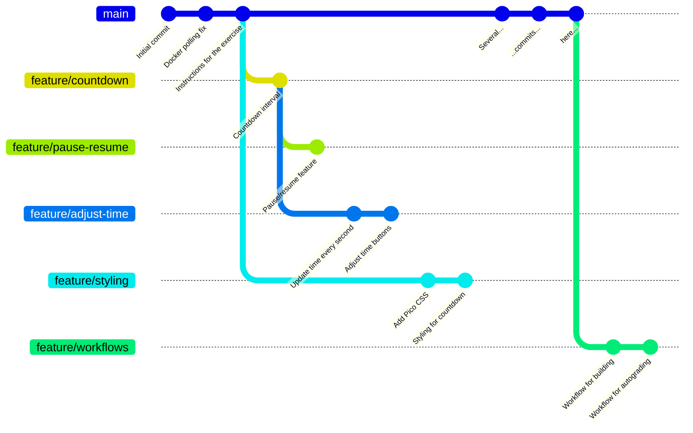
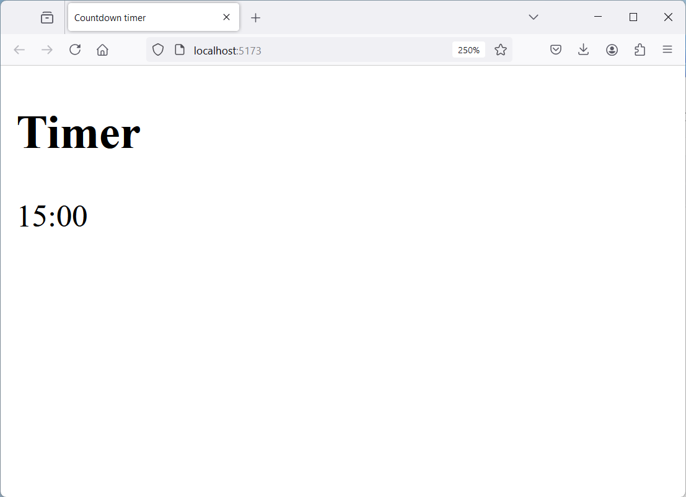
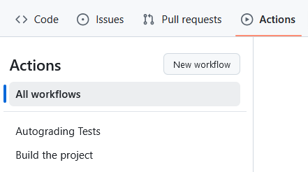
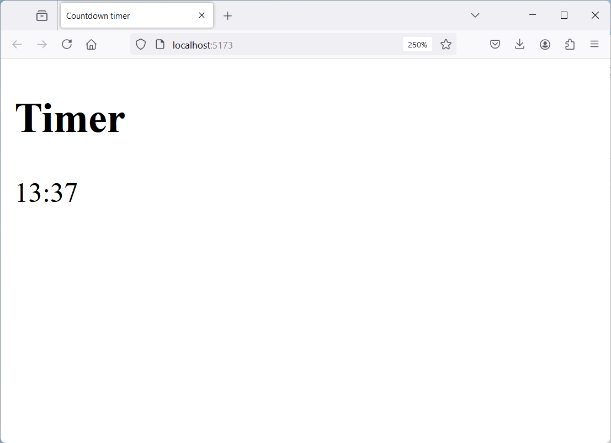
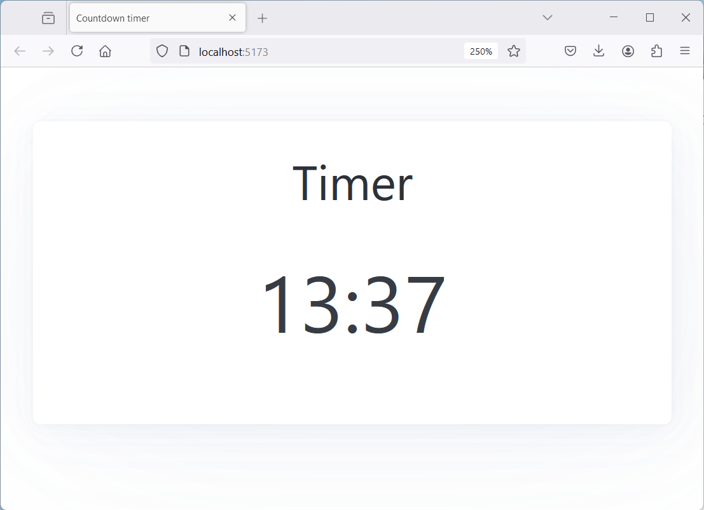
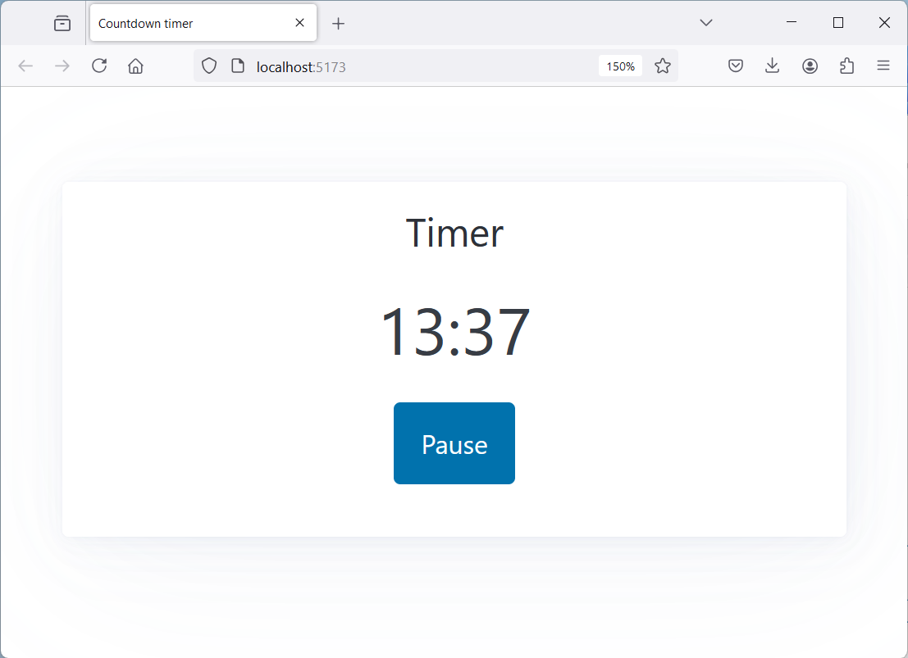
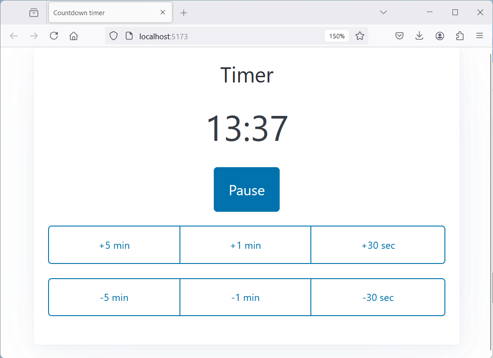

# Countdown Timer (Git Merge Exercise)

This repository contains a simple [React](https://react.dev/)-based countdown timer application built with [Vite](https://vite.dev/). Several features of the application have already been implemented, each of them in a separate branch. The goal of this exercise is to merge these branches into the main branch using Git.

Most of the branches in this exercise can be merged to `main` automatically, as they do not conflict with any previous changes. However, you will encounter at least one merge conflict that you will need to resolve manually. Don't worry, as conflicts are a normal part of working with Git, and resolving them is a valuable skill to learn.

In this exercise you will not need to write any new code, but you will need to understand a bit of the existing code. Although the code uses React and TypeScript, you don't need to be an expert in either of these. The merge conflicts require mainly understanding in HTML and perhaps a bit of JavaScript. Adding new code or making new changes is technically allowed, as long as the required features are merged, but it can lead to increased complexity.

> [!NOTE]
> You will need Node.js and npm installed on your machine to run the application and to complete the exercise. Alternatively, if you are familiar with [Docker](https://www.docker.com/), you can use the provided [Dockerfile](./Dockerfile) and [docker-compose.yml](./docker-compose.yml) to run the application in a container.


## Cloning the repository and listing branches

Branches can be merged both in GitHub and in your local copy of the Git repository. In this exercise, you will be merging the branches **in your local copy of the repository**. You can use either the command line or a GUI client to do this.

Start by cloning the repository to your local machine using the `git clone` command. Then, navigate to the cloned repository and see a list of branches using the `git branch` command. Use the command `git branch --all` to view all branches, including remote branches:

```bash
git branch           # list local branches
git branch --all     # list all branches
```

Alternatively, you can also use a GUI client to view the branches. In this case refer to the documentation of your client to see how to list the remote branches.

## Visualizing the branches

Sometimes it is hard to understand the relationships between branches and commits in Git. Visualizing the branches can help understand the structure of the repository and how the branches are related to each other. There are multiple commercial and open-source tools available to visualize Git branches, including command line tools and GUI clients. Git also comes with a few built-in tools.

For example, you can use the `git log` command with the `--graph` option to visualize the commit history and branches in the command line. This will show a graphical representation of the commit history, including branches and merges. Use the `--oneline` and `--all` options to show all branches and commits in a simplified format:

```bash
# run this command in the exercise folder
git log --all --graph --oneline
```

Alternatively, you can use the built-in `gitk` tool to visualize the branches in a GUI. This tool provides a graphical representation of the commit history, including branches and merges. It also allows you to view the commit messages and diffs for each commit. To use `gitk`, simply run the following command in your terminal:

```sh
# run this command in the exercise folder
gitk --all
```

At the starting point of the exercise, the branch structure looks approximately like this:




## 1. Getting started (the `main` branch)

The initial version of the app in the `main` branch has the basic project set up, but the countdown timer is not yet functional. Start by installing the project's dependencies, starting a development server and opening the app in your browser. You can do this by running the following commands:

```bash
# install dependencies from package.json
npm install

# start the development server
npm run dev

# alternatively, if you choose to use Docker, start the container
docker-compose up --build
```

The `npm run dev` command will print the URL where you can access the app. Open your browser and navigate to that URL to verify that the initial state of the app is working.



Note that the time on the screen is not counting down, as it will be implemented in the next steps. If the first steps fail due to any issues, make sure to fix them before proceeding. It is not ideal to get stuck on installation issues, as they are not the focus of this exercise.


## 2. Merge the `feature/workflows` branch (fast-forwarding)

The `feature/workflows` branch contains GitHub workflows that automate building the application and grading the exercise. This branch should be merged into the `main` branch first. You do not need to investigate or modify the workflows, but it is important to understand that adding them automates the process of building the application and grading the exercise. The workflows are triggered automatically when you push your code to the remote repository.

The `feature/workflows` branch can be "fast-forwarded" into the `main` branch, as the main branch does not have any commits that are not already in the `feature/workflows` branch. This means that the `main` branch can be "fast-forwarded" to the latest commit in the `feature/workflows` branch without creating a merge commit.

Use the following resources to learn how to merge branches in Git:

* [Git merge (Atlassian)](https://www.atlassian.com/git/tutorials/using-branches/git-merge)

After successfully merging the `feature/workflows` branch into the `main` branch, push your local `main` branch back to the remote repository using the `git push` command. This will trigger the GitHub Actions workflows to run. You can check the status of the workflows by navigating to the "Actions" tab in your GitHub repository:



The "Build the project" workflow should succeed, but the "Autograding Tests" workflow will fail, as you have not completed the exercise yet. You can ignore this for now, as you will fix it in the next steps.


## 3. Merge the `feature/countdown` branch (automatic merge)

The `feature/countdown` branch implements the countdown timer functionality so that the time on the screen counts down from the initial 15 minutes. This is a key feature of the application, and it is important to merge this branch into the `main` branch before any other features.

Merging the `feature/countdown` branch into the `main` branch should be straightforward. Even though both branches have changed, none of the files have changed in both branches, so there will be no need to resolve any conflicts.

After merging the `feature/countdown` branch, verify that the countdown timer is working correctly by refreshing the page in your browser and restarting the Vite process if necessary. You should see the countdown timer counting down from 15 minutes to 0:



If you encounter any issues, make sure to check both the terminal and the browser console for any error messages. If you see any errors, make sure to fix them before proceeding. When the timer works as expected, push your code to the remote repository and see the GitHub Actions workflows again. The building workflow should succeed and you should see more points in the grading workflow.


## 4. Merge the `feature/styling` branch (automatic merge)

Some of the users of our app have reported that the app looks a bit boring and they would like to see some styling improvements. The `feature/styling` branch implements some basic styling for the app, including an automatic dark mode switch based on the user's system settings.

Merge the `feature/styling` branch into `main`. After merging, verify that the styling changes are applied correctly by refreshing the page in your browser. You should see a more polished and visually appealing app:



Then, push your code to the remote repository and check the GitHub Actions workflows again. The "build" workflow should succeed and you should see more points in the "grading" workflow.


## 5. Merge the `feature/pause-resume` branch (automatic merge)

Now that the countdown timer works, an important feature that users have requested is the ability to pause and resume the countdown timer. The `feature/pause-resume` branch implements this feature. Continue by merging this branch into the `main` branch and verify that you can pause and resume the countdown timer by clicking the buttons below the counter:



When you have verified that the changes are correct and that the app works as expected, push your code to the remote repository and check the GitHub Actions workflows again. The building workflow should still succeed, and you should see more points in the grading workflow.


## 6. Merge the `feature/adjust-time` branch (merge conflict)

Many users have reported that they would like to be able to adjust the countdown time. The `feature/adjust-time` branch implements this feature, allowing users to adjust the countdown time either before starting the timer or during countdown.

Unfortunately, while the `feature/adjust-time` branch implements this cool feature, it has been developed in parallel with the `feature/pause-resume` branch. This means that both branches contain changes in the same lines of code in the [Timer.tsx](./src/Timer.tsx) file, which Git cannot automatically resolve. This is a common situation when working with Git, and it is important to learn how to resolve merge conflicts.

Therefore, to merge the `feature/adjust-time` branch into the `main` branch, you will need to resolve the merge conflict manually. You can use the command `git status` at any time to see the status of the repository and instructions about what to do next.

[Resolving a merge conflict using the command line (GitHub)](https://docs.github.com/en/pull-requests/collaborating-with-pull-requests/addressing-merge-conflicts/resolving-a-merge-conflict-using-the-command-line)

Resolving the conflicts require a few steps:

1. take note of the files containing conflicts reported by `git status`
2. edit the conflicting files one by one to fix the conflicts
3. verify that the changes are correct and that the app still works as expected: `npm run dev`
4. mark the edited files as resolved with `git add`
5. commit the changes with `git commit`

In our case, resolving the conflict in the `src/Timer.tsx` file should be straightforward. Both branches have added new buttons in the same place, but the buttons are different. You will need to keep both sets of buttons and add them after each other in the HTML structure:



When you have resolved the conflicts and committed the changes, push your code to the remote repository and check the GitHub Actions workflows again. The building workflow should still succeed, and you should now get all points in the grading workflow.


## Licenses

[React](https://github.com/facebook/react) is licensed under the MIT license: https://github.com/facebook/react/blob/main/LICENSE

[Vite](https://github.com/vitejs/vite) is licensed under the MIT license: https://github.com/vitejs/vite/blob/main/LICENSE

[Pico CSS Framework](https://github.com/picocss/pico) is licensed under the MIT license: https://github.com/picocss/pico/blob/main/LICENSE.md


## About this execise

This exercise has been created by Teemu Havulinna and it is licensed under a [Creative Commons BY-NC-SA license](https://creativecommons.org/licenses/by-nc-sa/4.0/).

AI tools, including ChatGPT and GitHub copilot, have been used to implement the exercise.
